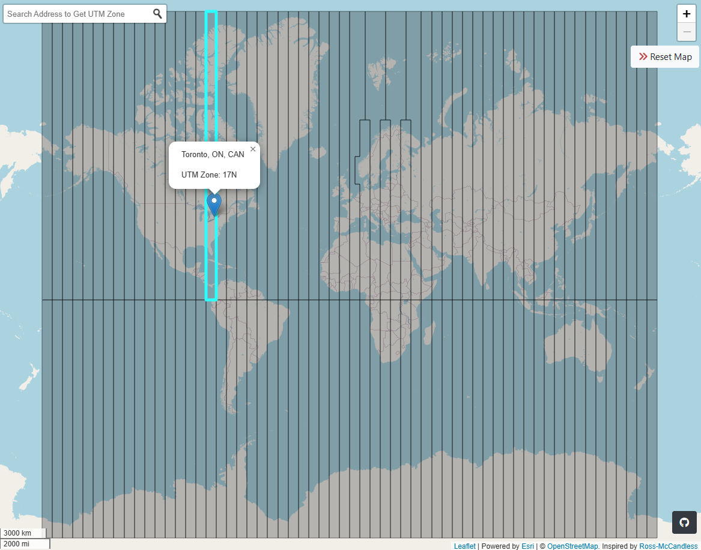

# UTM Zone Finder
A web map equipped with a tool to identify the Universal Transverse Mercator (UTM) Zones of the world.

## 📋 Features
- Use the search bar to look up the UTM zone of a specific address.
- Pan/ Zoom in and out of the map to any area and click on the polygon to get the UTM Zone information.
- Click on Reset Map to clear features displayed on the map.

## 🔧 Dependencies
- jQuery
- Leaflet
- <a href="https://github.com/Esri/esri-leaflet-geocoder">esri-leaflet-geocoder</a>
- Bootstrap
- <a href="https://www.npmjs.com/package/@turf/turf">turf JS </a>

## 💡 Sources
- ArcGIS REST Services Directory: <a href="https://services.arcgis.com/P3ePLMYs2RVChkJx/ArcGIS/rest/services/World_UTM_Grid/FeatureServer">UTMZones.geojson feature layer</a>